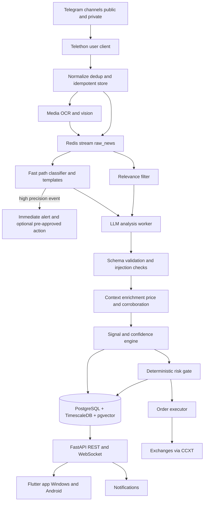

# 01 - Overview and System Architecture

## 1. Vision

A Windows and Android trading assistant that:

1. Listens to 50-500+ Telegram channels (public and private) in real time.
2. Normalizes crypto news into a single clean, structured stream.
3. Analyzes each item with AI for coin, event type, sentiment, and urgency.
4. Extracts an actionable position (LONG/SHORT, entry, stop loss, take profits,
   suggested leverage, time horizon).
5. Scores confidence using source credibility, corroboration, sentiment
   strength, and model certainty.
6. Applies a deterministic risk gate, then optionally places the order on an
   exchange through CCXT.
7. Presents everything in a desktop and mobile app with notifications.

## 2. Scope decision (read this first)

**Build a single-user, self-hosted tool first.** One operator, one set of
exchange keys, one risk budget. This removes multi-tenancy, per-user auth,
billing, and data-isolation work from the critical path.

Multi-user (a hosted service for other people) is a later product with a
different threat model, cost model, and legal review. It is explicitly out of
scope for v1. The docs below mention users; read that as "later".

## 3. Honest latency and edge analysis

This is a news-following tool, not a colocated HFT system. Be realistic:

| Event class | Typical move | Our realistic latency | Can we capture it? |
| :--- | :--- | :--- | :--- |
| Major exchange listing | seconds to minutes | 2-6 s after we see the post | Partially, and only if the channel posts early. Often too late. |
| Hack / exploit | seconds to minutes | 2-6 s | Partially. Higher value in avoiding longs than entering shorts. |
| Regulation / macro | hours to days | seconds to minutes | Yes. Slower-moving news is where this tool has an edge. |
| Partnership / adoption | hours to days | seconds to minutes | Yes. |
| Whale movement | minutes | seconds | Marginal. |

Consequences for design:

1. **Tiered processing.** A fast rule/classifier path fires an immediate alert
   (and optionally a pre-approved action) for high-precision templates such as
   "will list <TOKEN>", while the full LLM analysis runs asynchronously.
2. **Do not promise speed on listing news.** The value proposition is
   aggregation, deduplication, credibility weighting, and discipline, not being
   first.
3. **Latency budget is a tracked metric** from post timestamp to alert, and from
   alert to order. If it grows, investigate before scaling channels.

## 4. Design principles

1. **The LLM advises; deterministic code decides.** The model classifies and
   scores. Position size, leverage, and order placement are computed by
   deterministic code and gated by the risk manager. The LLM can never directly
   place an order or override a limit.
2. **Treat all message text as untrusted input.** Telegram content can contain
   prompt-injection attempts to manipulate the model. See `03`.
3. **Signal quality and market risk are separate numbers.** Confidence measures
   how good the signal is. A market-risk factor scales position size and can
   veto; it does not silently cap confidence. See `07`.
4. **At-least-once with idempotent consumers.** The queue guarantees delivery,
   not uniqueness. Every write is upserted on a natural key.
5. **Explainability.** Every signal links to the exact source messages and the
   exact code path and prompt version that produced it.
6. **Paper before live, always.** Live trading is a separate, explicitly enabled
   mode with its own limits.

## 5. Threat model (summary)

| Threat | Impact | Mitigation |
| :--- | :--- | :--- |
| Prompt injection in a channel post | Manipulated signal | Data/instruction separation, schema validation, anomalous-output detector, deterministic gate |
| Fabricated news / pump | Loss | Corroboration, credibility weighting, market cross-checks |
| Compromised exchange key | Fund loss | Server-side only, no withdrawal permission, IP allowlist, least privilege |
| Telegram account ban | Feed loss | Dedicated account, join throttling, backoff, no spammy behavior |
| Poison message crashing a worker | Pipeline stall | Dead-letter stream, schema validation, alerting |
| Stale channel silently dead | Missing news | Per-channel heartbeat and stale detector |

## 6. End-to-end architecture



## 7. Component responsibilities

| Component | Responsibility | Technology |
| :--- | :--- | :--- |
| Ingestor | Read messages, close reconnect gaps, download media | Python, Telethon |
| Normalizer | Clean, translate, cluster duplicates, store idempotently | Python, fastText, LLM |
| Queue | Durable buffer, replay, backpressure, dead letters | Redis Streams |
| Analyzer | Relevance filter, LLM structured analysis, enrichment | Python, LLM API, FinBERT |
| Signal engine | Convert analysis to a position with confidence | Python |
| Risk manager | Position sizing, limits, correlation, kill switch | Python |
| Executor | Place and manage orders, SL/TP, reconciliation | CCXT Pro |
| API | Serve news/signals, push real time, trigger actions | FastAPI, WebSockets |
| App | Feed, signal cards, portfolio, settings, kill switch | Flutter |
| Storage | News, signals, trades, candles, vectors | PostgreSQL, TimescaleDB, pgvector |

## 8. Tech stack decision

| Layer | Recommendation | Reason |
| :--- | :--- | :--- |
| Ingestion | Python + Telethon (MTProto user client) | Only the user API can read private channels |
| Backend | FastAPI + WebSockets | Async, fast, real-time push |
| Database | PostgreSQL + TimescaleDB + pgvector | Relational, time-series, and vectors in one engine |
| Cache/queue | Redis + Redis Streams | Cache, counters, durable streams with consumer groups |
| AI/NLP | LLM API + FinBERT + spaCy | LLM reasoning, cheap fast sentiment, entity rules |
| Trading | CCXT Pro | One interface for many exchanges and price feeds |
| App | Flutter (Windows + Android) | One Dart codebase |
| Infra | Docker + Docker Compose | Reproducible deployment |

Why one database: operating a single Postgres with Timescale and pgvector is
simpler than running a separate vector database and time-series store.

## 9. Throughput assumption (size the system)

Example: 300 active channels averaging 40 messages/day = 12,000/day, about 8
messages/minute on average, with bursts to 100+/minute during market events.

- After dedup and relevance filtering, expect 20-40% to reach the LLM: roughly
  2-4 LLM calls/minute average.
- At ~1,500 tokens per call and a cheap model, this is a few dollars per day.
- Peak load drives worker count and rate limits, not average load.

If these assumptions differ by 10x, revisit the queue sizing and LLM cost model.

## 10. Core concepts

1. **Source credibility**: channel weight 0.0-1.0, updated weekly from realized
   outcomes. Forwarders are not credited as originators.
2. **Signal confidence**: 0-100 quality score, calibrated against outcomes.
3. **Market-risk factor**: separate 0.0-1.0 multiplier applied to position size,
   with hard veto conditions.
4. **Event type**: listing, delisting, hack, partnership, regulation, unlock,
   whale_movement, macro, adoption, other.
5. **Paper first**: 4-6 weeks of paper trading plus a passing backtest before
   live trading.
6. **Explainability**: every signal traces to source messages, prompt version,
   and code version.

## 11. Repository layout (planned)

```text
newstrade1/
  docs/
  backend/
    app/
      api/          # FastAPI routers and websockets
      core/         # config, logging, security, feature flags
      models/       # SQLAlchemy models
      schemas/      # Pydantic schemas
      services/
        ingestion/  # telethon client, backfill, reconnect, media
        analysis/   # filters, fast path, llm client, prompts, validators
        signals/    # signal + confidence engine
        trading/    # risk manager, executor, exchange adapters
    alembic/        # migrations
    tests/
    pyproject.toml
    Dockerfile
  frontend/         # Flutter app
  deploy/
    docker-compose.yml
    .env.example
  scripts/
```

## 12. Success metrics

- Ingestion latency: post to database under 5 s (p95).
- Reconnect gap: zero missed messages after a reconnect (verified by min_id).
- Analysis accuracy: coin extraction F1 and event-type accuracy on a labeled set.
- Confidence calibration: realized win rate tracks the confidence bucket.
- Cost: under a few cents per analyzed message.
- Risk: zero limit breaches; daily loss stop respected.

## 13. Legal, privacy and risk warning

- Use your own Telegram account session and only read channels you are allowed
  to access. Scraping channels you cannot access violates Telegram terms.
- **Do not redistribute private channel content.** Displaying private channel
  text in an app can breach the channel's rules and copyright. Keep private
  content internal by default; if a channel is redistributed, make that an
  explicit per-channel setting and check its terms.
- This software is not financial advice. Show a disclaimer in the app.
- Cap risk per trade at 1-2% of equity. Derivatives rules vary by jurisdiction;
  gate futures trading by the user's region.
