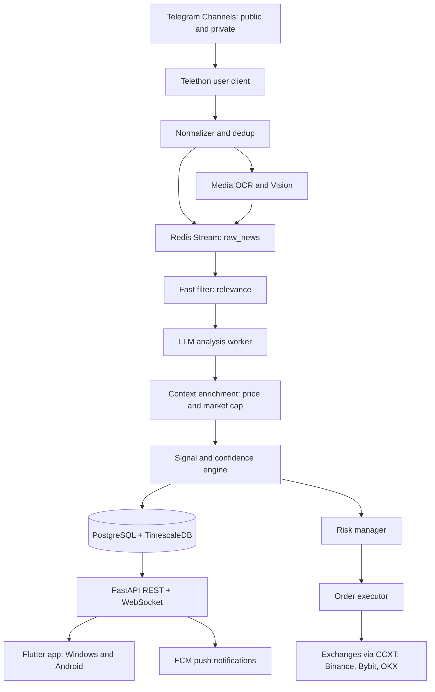

# 01 - Overview and System Architecture

## 1. Vision

A Windows and Android trading assistant that:

1. Listens to 50-500+ Telegram channels (public and private) in real time.
2. Normalizes crypto news into a single clean, structured stream.
3. Analyzes each item with AI for coin, event type, sentiment, and urgency.
4. Extracts an actionable position (LONG/SHORT, entry zone, stop loss, take
   profits, suggested leverage, time horizon).
5. Scores confidence using source credibility, corroboration, sentiment
   strength, and market context.
6. Routes signals through a risk manager to a crypto exchange using CCXT.
7. Presents everything in a desktop and mobile app with push notifications.

## 2. Goals and Non-Goals

### Goals

- Real-time ingestion with under 5 seconds from channel post to app display.
- Explainable signals: every trade shows the source news and a rationale.
- Strict risk management: no single signal can exceed the configured risk.
- Works offline for review: all news and signals are stored and searchable.

### Non-Goals (for the first release)

- HFT or sub-second arbitrage.
- On-chain analytics or wallet tracking.
- Financial advice. This is a decision-support tool.

## 3. End-to-End Architecture



## 4. Component Responsibilities

| Component | Responsibility | Technology |
| :--- | :--- | :--- |
| Ingestor | Read messages from channels, backfill history, download media | Python, Telethon |
| Normalizer | Clean text, detect language, translate, deduplicate | Python, fastText, LLM |
| Queue | Buffer raw items between stages, replay and backpressure | Redis Streams |
| Analyzer | Relevance filter, LLM structured analysis, enrichment | Python, LLM API, FinBERT |
| Signal engine | Convert analysis into a position with confidence | Python |
| Risk manager | Position sizing, limits, kill switch | Python |
| Executor | Place and manage orders, set SL/TP on exchange | CCXT Pro |
| API | Serve news and signals, push real time, execute manual trades | FastAPI, WebSockets |
| App | News feed, signal cards, portfolio, settings | Flutter |
| Storage | News, signals, trades, prices, vectors | PostgreSQL, TimescaleDB, pgvector |

## 5. Tech Stack Decision

| Layer | Recommendation | Reason |
| :--- | :--- | :--- |
| Ingestion | Python + Telethon (MTProto user client) | Only MTProto user API can read private channels. Bot API is not sufficient. |
| Backend API | FastAPI + WebSockets | Async, fast, good for real-time push |
| Database | PostgreSQL + TimescaleDB + pgvector | Relational data, time-series prices, semantic search in one engine |
| Cache and queue | Redis + Redis Streams | Fast cache and durable stream with consumer groups |
| AI and NLP | LLM API + FinBERT + spaCy | LLM for reasoning, FinBERT for cheap fast sentiment |
| Trading | CCXT Pro | One interface for many exchanges, WebSocket price feeds |
| Desktop app | Flutter Desktop | Single codebase with Android |
| Android app | Flutter | Same codebase as desktop |
| Infra | Docker + Docker Compose | Reproducible deployment on a VPS |

### Why Flutter for both platforms

One Dart codebase targets Windows and Android, plus web if needed later. The
alternative (Electron for Windows + React Native for Android) doubles the UI
work and should only be chosen if the team is already React-heavy.

## 6. Core Concepts

1. **Source credibility score**: every channel has a weight from 0.0 to 1.0
   based on its historical accuracy, updated weekly.
2. **Signal confidence**: a 0-100 score combining source weight, corroboration,
   LLM certainty, and sentiment strength, adjusted by market volatility.
3. **Event type**: the classification of news (listing, hack, partnership,
   regulation, unlock, whale movement, macro, other).
4. **Paper first**: never trade live before 4-6 weeks of paper trading and a
   completed backtest.
5. **Explainability**: every signal links back to the exact messages that
   produced it.

## 7. Repository Layout (planned)

```text
newstrade1/
  docs/                     # this planning documentation
  backend/
    app/
      api/                  # FastAPI routers and websockets
      core/                 # config, logging, security
      models/               # SQLAlchemy models
      schemas/              # Pydantic schemas
      services/
        ingestion/          # Telethon client, backfill, media
        analysis/           # filters, LLM client, prompts
        signals/            # signal and confidence engine
        trading/            # risk manager, executor, exchange adapters
    alembic/                # database migrations
    tests/
    pyproject.toml
    Dockerfile
  frontend/                 # Flutter app
  deploy/
    docker-compose.yml
    .env.example
  scripts/
```

See `09-implementation-guide.md` for the build order.

## 8. Environments

| Environment | Purpose | Notes |
| :--- | :--- | :--- |
| local | Development | Docker Compose with Postgres and Redis |
| staging | Paper trading | Real ingestion, fake money, full logging |
| production | Live trading | Only after staging KPIs are met |

## 9. Success Metrics

- Ingestion latency: post to database under 5 seconds at the 95th percentile.
- Analysis cost: under a few cents per message at production volume.
- Signal precision: win rate and profit factor measured in paper trading.
- Availability: ingestor uptime above 99% with automatic reconnect.

## 10. Legal and Risk Warning

- You must use your own Telegram account session to read private channels you
  are a member of. Scraping channels you cannot access violates Telegram terms.
- This software is not financial advice. Always show a disclaimer in the app.
- Use strict risk management. Cap risk per trade at 1-2% of account equity.
- Respect exchange terms of service and local regulations.
