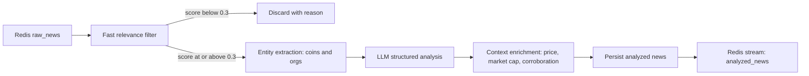

# 03 - Phase 2: Analysis and Signal Extraction

This phase turns normalized messages into structured, analyzed news items. It
does not yet decide trade levels; that is Phase 3.

## Pipeline overview



## Step 1: Fast relevance filter (target under 20 ms)

Goal: drop memes, spam, and off-topic chat before spending money on an LLM.

Implementation:

1. A whitelist of coin symbols and aliases (BTC, ETH, SOL, and so on).
2. A regex set for event keywords (listing, delist, hack, exploit, partnership,
   regulation, SEC, ETF, unlock, airdrop, hack, hack, partnership).
3. Optional FinBERT-Crypto sentiment classifier running locally.

```python
COIN_ALIASES = {
    "BTC": ["btc", "bitcoin"],
    "ETH": ["eth", "ethereum", "ether"],
    "SOL": ["sol", "solana"],
}

EVENT_KEYWORDS = {
    "listing": ["listing", "lists", "will list", "spot listing"],
    "delisting": ["delist", "delisting", "removal"],
    "hack": ["hack", "exploit", "breach", "drained", "stolen"],
    "regulation": ["sec", "cftc", "regulation", "lawsuit", "ban", "etf"],
    "partnership": ["partnership", "collaboration", "integrates", "teams up"],
    "unlock": ["unlock", "vesting", "token release"],
    "whale": ["whale", "large transfer", "moved to exchange"],
    "macro": ["cpi", "fed", "interest rate", "inflation", "powell"],
}


def relevance_score(text: str) -> float:
    lowered = text.lower()
    score = 0.0
    for aliases in COIN_ALIASES.values():
        if any(alias in lowered for alias in aliases):
            score += 0.4
            break
    for words in EVENT_KEYWORDS.values():
        if any(word in lowered for word in words):
            score += 0.4
            break
    if len(lowered) > 40:
        score += 0.2
    return min(score, 1.0)
```

Threshold: discard items with `score < 0.3`, but store them with a discard
reason so thresholds can be tuned later.

## Step 2: Entity and event extraction

Extract the coin(s) and organizations before the LLM call so the LLM receives a
hint and the corpus is filterable.

- Coin resolution: map ticker to a canonical asset id via CoinGecko's coin list.
- Organizations: exchanges, funds, regulators, projects.
- Use spaCy `EntityRuler` with a custom pattern list, or a small LLM call for
  ambiguous cases.

## Step 3: LLM structured analysis (1-3 seconds)

Use one LLM call per message with a strict JSON output schema. Validate the JSON
and retry once on parse failure.

### Prompt template

```text
You are a crypto market news analyst. Analyze the Telegram message below.

Message: "{cleaned_text}"
Source channel: {channel_name}
Posted at: {timestamp}
Detected coins: {coins_hint}

Return ONLY a valid JSON object with exactly these fields:
{
  "is_tradable": true,
  "coins": ["BTC"],
  "event_type": "listing",
  "sentiment": "bullish",
  "sentiment_score": 0.0,
  "urgency": "high",
  "certainty": 0.0,
  "summary": "one sentence",
  "impact_timeframe": "intraday",
  "market_scope": "single_asset",
  "reasoning": "short explanation"
}

Field rules:
- event_type is one of: listing, delisting, hack, partnership, regulation,
  unlock, whale_movement, macro, adoption, other.
- sentiment is one of: bullish, bearish, neutral.
- sentiment_score is a float from -1.0 to 1.0.
- urgency is one of: low, medium, high, critical.
- certainty is a float from 0.0 to 1.0, your confidence in this analysis.
- impact_timeframe is one of: scalp, intraday, swing.
- market_scope is one of: single_asset, sector, market_wide.
- If the message is not crypto-relevant or not tradable, set is_tradable false.
```

### Validation schema

File: `backend/app/schemas/analysis.py`

```python
from enum import Enum

from pydantic import BaseModel, Field


class EventType(str, Enum):
    listing = "listing"
    delisting = "delisting"
    hack = "hack"
    partnership = "partnership"
    regulation = "regulation"
    unlock = "unlock"
    whale_movement = "whale_movement"
    macro = "macro"
    adoption = "adoption"
    other = "other"


class Sentiment(str, Enum):
    bullish = "bullish"
    bearish = "bearish"
    neutral = "neutral"


class Urgency(str, Enum):
    low = "low"
    medium = "medium"
    high = "high"
    critical = "critical"


class Analysis(BaseModel):
    is_tradable: bool
    coins: list[str] = Field(default_factory=list)
    event_type: EventType = EventType.other
    sentiment: Sentiment = Sentiment.neutral
    sentiment_score: float = Field(ge=-1.0, le=1.0)
    urgency: Urgency = Urgency.low
    certainty: float = Field(ge=0.0, le=1.0)
    summary: str
    impact_timeframe: str = "intraday"
    market_scope: str = "single_asset"
    reasoning: str = ""
```

Call the model with `response_format` set to JSON when the provider supports it.
Log the raw response, the parsed result, token usage, and cost per message.

## Step 4: Context enrichment

Add the market context the LLM cannot know reliably:

1. **Live price and liquidity** from CCXT or CoinGecko.
2. **Market cap tier**: low-cap coins move more on single news; weight higher.
3. **Spread and volume**: illiquid assets are risky to trade on news.
4. **Corroboration**: count independent channels that reported the same event
   within a time window (default 10 minutes).
5. **Existing exposure**: do we already have a position in this asset?
6. **Macro calendar**: is a high-impact event (CPI, FOMC) imminent?

```python
async def enrich(analysis, news_item, market) -> dict:
    price = await market.fetch_price(analysis.coins[0])
    cap = await market.market_cap(analysis.coins[0])
    corroboration = await news_item.count_independent_sources(minutes=10)
    return {
        "price": price,
        "market_cap_tier": market.cap_tier(cap),
        "corroboration_count": corroboration,
        "macro_window": market.in_macro_window(),
    }
```

## Step 5: Persist and publish

- Store the analyzed news item in the `news` table with the analysis columns.
- Publish to the Redis stream `analyzed_news` for the signal engine.
- Update the source channel's running statistics (how many tradable items, and
  later whether they were correct).

## Cost control

- Run the fast filter first; only send relevant messages to the LLM.
- Use a cheap model for classification and a stronger model only for
  high-urgency or ambiguous cases.
- Batch messages when the provider allows it.
- Cache analysis by content hash so a duplicate from a new channel reuses the
  previous analysis and only updates corroboration.

## Error handling

- LLM timeout: retry with exponential backoff, max 3 attempts.
- Invalid JSON: retry once with a repair prompt, then mark as failed and store
  the raw response for inspection.
- Missing price: still store the news but mark the signal as not tradable until
  price data is available.

## Deliverables for Phase 2

- [ ] Relevance filter with tunable thresholds and discard reasons.
- [ ] Entity and event extraction.
- [ ] LLM analysis with validated JSON output and retries.
- [ ] Context enrichment with live price and corroboration.
- [ ] Analyzed news persisted and published to a stream.
- [ ] Cost and latency dashboards per stage.

## Phase 2 acceptance tests

1. A bullish listing message yields `event_type=listing` and non-zero sentiment.
2. An off-topic meme is discarded by the fast filter without an LLM call.
3. A message in another language is translated, analyzed, and stored with both
   original and normalized text.
4. A malformed LLM response triggers one repair retry and does not crash the
   worker.
