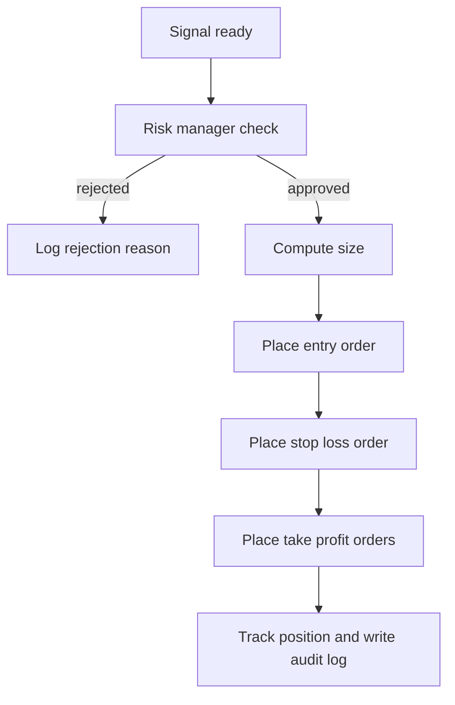

# 04 - Phase 3: Position Extraction and Trading Engine

This phase converts an analyzed news item into a concrete position and, in later
stages, places it on an exchange.

## 1. Position extraction

### 1.1 Two-step approach (recommended)

Do not let the LLM invent price levels from nothing. Use a hybrid:

1. The LLM provides direction, bias, and timeframe.
2. A technical engine calculates entry, stop loss, and take profit levels from
   real market data.

### 1.2 Signal schema

File: `backend/app/schemas/signal.py`

```python
from datetime import datetime
from enum import Enum

from pydantic import BaseModel


class Direction(str, Enum):
    LONG = "LONG"
    SHORT = "SHORT"
    NO_TRADE = "NO_TRADE"


class Signal(BaseModel):
    signal_id: str
    asset: str
    direction: Direction
    entry_zone: tuple[float, float]
    stop_loss: float
    take_profits: list[float]
    leverage_suggested: int
    timeframe: str
    confidence: int
    rationale: str
    source_news_ids: list[str]
    created_at: datetime
    expires_at: datetime
    risk_reward: float
```

### 1.3 Computing levels

Given direction and current price:

1. Fetch recent candles via CCXT.
2. Compute ATR over 14 periods.
3. Set stop loss:
   - LONG: `entry - (atr_multiplier * ATR)`, default multiplier 1.5.
   - SHORT: `entry + (atr_multiplier * ATR)`.
4. Set entry zone as a small band around the current price, for example plus or
   minus 0.25 ATR.
5. Set take profits at multiples of the risk distance (R):
   - TP1 at 1.5R, TP2 at 2.5R, TP3 at 4R.
6. Compute risk/reward as reward to TP1 divided by risk.
7. Reject the signal if risk/reward is below 1.5.

```python
def build_levels(direction, price, atr, atr_mult=1.5):
    risk = atr_mult * atr
    if direction == "LONG":
        stop = price - risk
        tps = [price + risk * r for r in (1.5, 2.5, 4.0)]
    else:
        stop = price + risk
        tps = [price - risk * r for r in (1.5, 2.5, 4.0)]
    return stop, tps
```

### 1.4 Expiry

News edges decay fast. Set `expires_at` based on impact timeframe:

- scalp: 15 minutes
- intraday: 4 hours
- swing: 3 days

After expiry, the signal becomes read-only "news" and cannot be executed.

## 2. Confidence engine

See `07-confidence-risk-and-backtesting.md` for the full formula. Summary:

```text
confidence = 100 * (
    0.30 * source_credibility
  + 0.25 * llm_certainty
  + 0.25 * corroboration_score
  + 0.20 * sentiment_strength
) * market_volatility_factor
```

Buckets:

| Confidence | Action | Risk per trade |
| :--- | :--- | :--- |
| below 60 | NO_TRADE, show as news only | 0% |
| 60-74 | low size signal | 0.5% |
| 75-84 | medium signal | 1.0% |
| 85 and above | high signal | 2.0% maximum |

## 3. Exchange integration with CCXT

### 3.1 Install

```bash
pip install --break-system-packages "ccxt[pro]" sqlalchemy asyncpg
```

### 3.2 Exchange adapter

File: `backend/app/services/trading/exchanges.py`

```python
import ccxt.pro as ccxtpro


def build_exchange(name: str, api_key: str, secret: str, testnet: bool = True):
    klass = getattr(ccxtpro, name)
    exchange = klass({
        "apiKey": api_key,
        "secret": secret,
        "enableRateLimit": True,
        "options": {"defaultType": "swap"},
    })
    if testnet:
        exchange.set_sandbox_mode(True)
    return exchange
```

### 3.3 Fetch price and balance

```python
async def snapshot(exchange, symbol: str) -> dict:
    ticker = await exchange.fetch_ticker(symbol)
    balance = await exchange.fetch_balance()
    return {
        "price": ticker["last"],
        "bid": ticker["bid"],
        "ask": ticker["ask"],
        "free_usdt": balance.get("USDT", {}).get("free", 0.0),
    }
```

### 3.4 Supported exchanges

Start with Binance and Bybit (deep futures liquidity). Add OKX and Bitget later.
For US users, prefer Coinbase or Kraken where futures access is compliant.

## 4. Risk manager (mandatory)

The risk manager is the only component allowed to size and approve orders.

File: `backend/app/services/trading/risk.py`

Rules:

- Max risk per trade: from the confidence bucket, hard cap 2%.
- Max concurrent open positions: 3.
- Max aggregate open risk: 5% of equity.
- Max leverage: 5x, regardless of what the signal suggests.
- Daily loss limit: -3% of equity; when hit, stop trading for the day and alert.
- Weekly loss limit: -8%; require manual reset.
- Minimum time between entries on the same asset: 15 minutes.
- No new entries when spread exceeds 0.5% or in a configured macro window.
- Kill switch: a single config flag or API call that cancels new orders and
  flattens positions on demand.

Position sizing:

```python
def position_size(equity: float, risk_pct: float, entry: float, stop: float) -> float:
    risk_amount = equity * risk_pct
    per_unit_risk = abs(entry - stop)
    if per_unit_risk <= 0:
        raise ValueError("stop must differ from entry")
    return risk_amount / per_unit_risk
```

## 5. Order execution

### 5.1 Execution flow



### 5.2 Placing an order

```python
async def execute(signal, equity, exchange):
    size = position_size(
        equity=equity,
        risk_pct=signal.risk_pct,
        entry=signal.entry_zone[0],
        stop=signal.stop_loss,
    )
    side = "buy" if signal.direction == "LONG" else "sell"
    params = {
        "stopLoss": signal.stop_loss,
        "takeProfit": signal.take_profits[0],
    }
    order = await exchange.create_order(
        signal.asset, "market", side, size, None, params
    )
    return order
```

Always place stop loss and take profit on the exchange side, not only in the
app. If the app or server crashes, exchange-side protection still works.

### 5.3 Idempotency and duplicate protection

- Use a client order id derived from `signal_id` so retries do not double-fill.
- Store order state transitions in an `orders` table.
- Reconcile open positions on startup by calling `fetch_positions`.

## 6. Trading modes

| Mode | Description |
| :--- | :--- |
| Paper | Simulated fills at live prices, full logging to `paper_trades`. Default. |
| Manual live | Each signal requires a confirm tap plus 2FA. |
| Auto live | Requires an explicit toggle, a max-notional cap, and the kill switch. |

Never enable auto live until paper trading and backtesting meet the targets in
`07-confidence-risk-and-backtesting.md`.

## 7. Backtesting

Before live trading:

1. Replay 3-6 months of scraped Telegram history.
2. For each signal, simulate entry at the historical price after the message
   timestamp, with realistic slippage and fees.
3. Apply the same risk manager rules.
4. Measure win rate, profit factor, max drawdown, average holding time, and
   performance by event type and by channel.

```python
METRICS = ["win_rate", "profit_factor", "max_drawdown", "expectancy"]
```

If profit factor is below 1.3 or max drawdown exceeds 20% in the backtest, do
not go live; tune the confidence weights and thresholds first.

## Deliverables for Phase 3

- [ ] Position extractor producing the Signal schema.
- [ ] Confidence engine wired to the analysis output.
- [ ] CCXT exchange adapter with testnet support.
- [ ] Risk manager with all limits and a kill switch.
- [ ] Paper trading with a full audit log.
- [ ] Backtesting harness and a written results report.

## Phase 3 acceptance tests

1. A high-confidence listing signal produces a sized order on testnet with SL
   and TP attached.
2. A signal exceeding a risk limit is rejected with the exact reason logged.
3. Restarting the executor reconciles positions and does not duplicate orders.
4. The backtest reports the standard metrics for at least 3 months of data.
