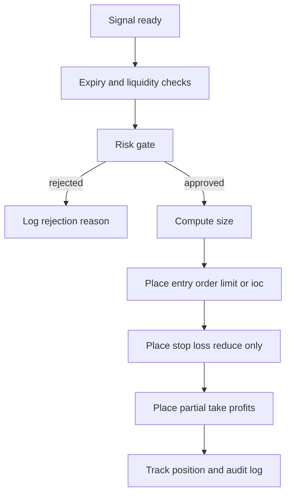

# 04 - Phase 3: Signals, Confidence, Risk and Trading

This phase converts an analyzed news item into a concrete position and, in later
stages, places it on an exchange. It contains three parts: position extraction,
the risk engine, and execution.

## 1. Position extraction

### 1.1 Hybrid approach (required)

Do not let the LLM invent price levels. Use a hybrid:

1. The LLM contributes direction bias, sentiment, and timeframe.
2. A deterministic technical engine computes entry, stop loss, take profits, and
   size from real market data.
3. The risk gate approves or vetoes.

The LLM never sets size, leverage, or order parameters.

### 1.2 Signal schema

File: `backend/app/schemas/signal.py`

```python
from datetime import datetime
from enum import Enum

from pydantic import BaseModel


class Direction(str, Enum):
    LONG = "LONG"
    SHORT = "SHORT"
    NO_TRADE = "NO_TRADE"


class Signal(BaseModel):
    signal_id: str
    news_id: int
    asset: str
    direction: Direction
    entry_low: float
    entry_high: float
    order_type: str          # "limit" or "market_ioc"
    stop_loss: float
    take_profits: list[float]
    leverage_suggested: int
    timeframe: str
    confidence: int
    market_risk_factor: float
    rationale: str
    source_news_ids: list[str]
    prompt_version: str
    created_at: datetime
    expires_at: datetime
    risk_reward: float
```

### 1.3 Computing levels

1. Fetch recent candles for the signal timeframe.
2. Compute ATR(14).
3. Stop loss:
   - LONG: `entry - (atr_multiplier * ATR)`, default 1.5.
   - SHORT: `entry + (atr_multiplier * ATR)`.
4. Entry zone: a band of plus or minus 0.25 ATR around the current price.
5. Take profits at 1.5R, 2.5R, 4R, with partial exits (see 4.4).
6. Reject if risk/reward to TP1 is below 1.5.

```python
def build_levels(direction, price, atr, atr_mult=1.5):
    risk = atr_mult * atr
    if direction == "LONG":
        stop = price - risk
        tps = [price + risk * r for r in (1.5, 2.5, 4.0)]
    else:
        stop = price + risk
        tps = [price - risk * r for r in (1.5, 2.5, 4.0)]
    return stop, tps
```

### 1.4 Entry type and consistency

The old plan showed an `entry_zone` but executed a market order, which is
inconsistent. Choose explicitly:

- **Default: limit order** inside the entry zone with a timeout (for example 60
  seconds). If unfilled, cancel; do not chase.
- **`market_ioc`** only for urgent, liquid events, and only if the estimated
  slippage is under the configured cap.

Never send a market order on an asset whose order book depth is thinner than the
intended position. Check depth first.

### 1.5 Expiry

News edges decay. Set `expires_at` from the impact timeframe: scalp 15 min,
intraday 4 h, swing 3 days. After expiry the signal becomes read-only news.

## 2. Confidence engine

Full formula and calibration are in `07-confidence-risk-and-backtesting.md`.
Summary, with the critical fix that confidence is NOT multiplied by volatility:

```text
confidence = 100 * (
    0.30 * source_credibility
  + 0.25 * llm_certainty
  + 0.25 * corroboration_score
  + 0.20 * conviction_strength
)
```

`confidence` is a signal-quality number in 0-100. Market conditions are handled
separately by `market_risk_factor`, which scales position size and can veto.

Buckets (starting values, to be calibrated):

| Confidence | Action | Base risk per trade |
| :--- | :--- | :--- |
| below 60 | NO_TRADE, news only | 0% |
| 60-74 | low size | 0.5% |
| 75-84 | medium size | 1.0% |
| 85 and above | high size | 2.0% maximum |

## 3. Exchange integration with CCXT

### 3.1 Install

```bash
pip install --break-system-packages "ccxt[pro]" sqlalchemy asyncpg
```

### 3.2 Adapter

File: `backend/app/services/trading/exchanges.py`

```python
import ccxt.pro as ccxtpro


def build_exchange(name: str, api_key: str, secret: str, testnet: bool = True):
    klass = getattr(ccxtpro, name)
    exchange = klass({
        "apiKey": api_key,
        "secret": secret,
        "enableRateLimit": True,
        "options": {"defaultType": "swap"},
    })
    if testnet:
        exchange.set_sandbox_mode(True)
    return exchange
```

Exchange keys live only on the server. The Flutter app never holds them.

### 3.3 Supporting data

Before trading, fetch and validate:

- `fetch_ticker` for price, bid, ask, spread.
- `fetch_order_book` depth for slippage estimation.
- `fetch_funding_rate` for perpetuals (funding is a real cost).
- `fetch_positions` for reconciliation.

### 3.4 Supported exchanges

Start with two deep-liquidity venues (for example Binance and Bybit). Add others
later. Gate futures by the operator's jurisdiction.

## 4. Risk engine (mandatory)

The risk engine is the only component allowed to size and approve orders.

File: `backend/app/services/trading/risk.py`

### 4.1 Limits

| Limit | Value |
| :--- | :--- |
| Risk per trade | base 0.5-2.0% by confidence, scaled by market risk |
| Max concurrent positions | 3 |
| Max aggregate open risk | 5% of equity |
| Max net correlated exposure | 1.5x the single-trade risk budget |
| Max leverage | 5x, regardless of the signal |
| Daily loss stop | -3% of equity, auto stop for the day |
| Weekly loss stop | -8%, manual reset |
| Cooldown per asset | 15 minutes |
| Max spread to enter | 0.5% |
| Max slippage | 0.3% or 0.5 ATR, whichever is smaller |
| Max position vs volume | below 1% of recent average volume |
| Min liquidation distance | liquidation at least 2x the stop distance |

### 4.2 Correlation risk

Three crypto positions are usually one trade. All-long positions in
BTC-correlated assets multiply risk rather than diversify it.

- Compute a rolling correlation (for example 30-day) of each asset to BTC.
- Cap the aggregate directional (beta-adjusted) exposure to a multiple of the
  single-trade risk budget.
- When the cap binds, reject the new signal or reduce size.

### 4.3 Position sizing

```python
def position_size(equity, risk_pct, entry, stop):
    risk_amount = equity * risk_pct
    per_unit_risk = abs(entry - stop)
    if per_unit_risk <= 0:
        raise ValueError("stop must differ from entry")
    return risk_amount / per_unit_risk
```

Effective risk: `risk_pct = base_risk(confidence) * market_risk_factor`, with
`market_risk_factor` in [0.5, 1.0] and a hard veto above extreme volatility.

### 4.4 Partial take-profits and stop management

The schema lists multiple take profits; the executor must manage them.

1. Place TP1, TP2, TP3 as reduce-only orders for one third each, or place TP1
   and trail the remainder.
2. When TP1 fills, move the stop to breakeven.
3. Optionally trail the stop by ATR for swing trades.
4. If the protective stop is rejected by the exchange, flatten immediately.

Partial exits are the difference between a plan and a screenshot.

### 4.5 Kill switch

A single flag checked at the top of the execution path. When true: reject new
entries, optionally cancel open orders, optionally flatten positions. Triggered
by the API, a config flag, or automatically when a loss limit is hit.

### 4.6 Failure modes

- Exchange outage: retry with backoff, then alert; do not flood.
- Partial fill: reconcile via `fetch_positions`, adjust protective orders.
- Stop gap-through: record slippage, count toward loss limits.
- Clock skew: use exchange server time for order timestamps.
- Funding spike: include funding in expected cost; avoid holding through
  known extreme funding unless intended.

## 5. Order execution

### 5.1 Flow



### 5.2 Placing an order

```python
async def execute(signal, equity, exchange):
    size = position_size(
        equity=equity,
        risk_pct=signal.risk_pct,
        entry=signal.entry_low,
        stop=signal.stop_loss,
    )
    side = "buy" if signal.direction == "LONG" else "sell"
    params = {"reduceOnly": False, "clientOrderId": signal.signal_id}
    order = await exchange.create_order(
        signal.asset, signal.order_type, side, size, signal.entry_low, params
    )
    return order
```

Rules:

- Always set stop loss and take profit on the exchange side, not only in the
  app. If the server crashes, exchange-side protection still holds.
- Use a client order id derived from `signal_id` for idempotency.
- Never let the analysis model call this function.

### 5.3 Idempotency and reconciliation

- Deterministic `signal_id`; duplicate execution attempts are no-ops.
- Persist every order state transition.
- On startup, reconcile open positions and orders against the exchange and
  repair any missing protective orders.

## 6. Trading modes

| Mode | Description |
| :--- | :--- |
| Paper | Simulated fills at live prices, full logging. Default. |
| Manual live | Each signal requires a confirm tap plus 2FA. |
| Auto live | Explicit toggle, max-notional cap, kill switch, and only after gates. |

## 7. Backtesting

Before live:

1. Replay 3-6 months of scraped history.
2. Simulate entry at the historical price after the message timestamp, with
   realistic fees and slippage.
3. Apply the same risk rules and partial exits.
4. Measure win rate, profit factor, max drawdown, expectancy, average holding
   time, and metrics segmented by event type, confidence bucket, and channel.
5. Use walk-forward validation and hold out a period; report how many parameter
   combinations were tried.

If profit factor is below 1.3 or max drawdown exceeds 20% on held-out data, do
not go live. Details and calibration are in `07`.

## Deliverables for Phase 3

- [ ] Position extractor producing the Signal schema.
- [ ] Confidence engine with the corrected formula.
- [ ] Market-risk factor separate from confidence.
- [ ] CCXT adapter with testnet, depth, funding, and spread checks.
- [ ] Risk manager with all limits, correlation cap, and kill switch.
- [ ] Partial take-profit and stop-management logic.
- [ ] Idempotent execution with startup reconciliation.
- [ ] Paper trading with a full audit log.
- [ ] Backtesting harness with walk-forward validation and a written report.

## Phase 3 acceptance tests

1. A high-confidence signal places a sized limit order on testnet with SL and
   partial TPs attached.
2. A signal exceeding any limit is rejected with the exact reason logged.
3. Three correlated long signals are capped by the correlation rule.
4. Killing and restarting the executor does not duplicate orders and repairs any
   missing stop.
5. Backtest reports the standard metrics on held-out data.
